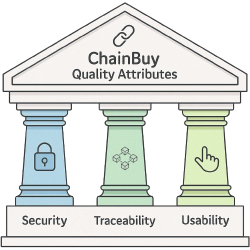

# ChainBuy Architecture Haiku

## Objetivo

- Prover uma plataforma de e-commerce segura, transparente e rastreável, utilizando blockchain para registrar eventos críticos e garantir confiança entre usuários.

## Requisitos Funcionais

- Cadastro e autenticação de usuários e vendedores.
- Exibição e busca de produtos.
- Realização de pedidos com validação e atualização automática de estoque.
- Pagamentos digitais (criptomoedas e cartões).
- Registro imutável de transações, avaliações e status de pedidos na blockchain.
- Consulta ao histórico de pedidos e avaliações.
- Integração com transportadoras.

## Restrições Técnicas

- Adaptar o funcionamento do e-commerce ao uso da blockchain.
- Garantir a segurança e confiabilidade dos dados disponibilizados.
- Gerir a infraestrutura de modo a controlar os gastos sem sacrificar a flexibilidade.

## Atributos de Qualidade
- Priorizados da seguinte forma:  
    - **Segurança**: Autenticação robusta, armazenamento seguro de dados sensíveis.  
    - **Rastreabilidade**: Blockchain como fonte de verdade.  
    - **Usabilidade**: Uso fácil e intuitivo.  

  

## Decisões de Design

Tecnologias Escolhidas:

- **React** para o desenvolvimento do frontend, proporcionando uma interface moderna e responsiva.
- **.NET** para o backend, garantindo robustez, segurança e integração eficiente com serviços AWS.
- **PostgreSQL** (Amazon RDS) como banco de dados relacional, assegurando confiabilidade e escalabilidade.
- **Amazon Managed Blockchain** para registro imutável de eventos críticos.
- **REST API** como padrão de comunicação entre frontend, backend e módulos internos.
- **AWS** como base da infraestrutura, utilizando serviços gerenciados para facilitar manutenção e escalabilidade.
- Integração com gateways de pagamento e provedores de autenticação de terceiros.

Arquitetura do Sistema:

- **Frontend**: Aplicação SPA desenvolvida em React, hospedada em Amazon S3 e distribuída via CloudFront.
- **API Layer**: Backend em .NET, exposto via REST API, responsável pela lógica de negócio e orquestração dos módulos.
- **Domínio**: Módulos independentes para pedidos, produtos, pagamentos, autenticação e blockchain, promovendo baixo acoplamento e alta coesão.
- **Infraestrutura**: Serviços AWS (EC2, RDS, Managed Blockchain, API Gateway, CloudFront, S3) compondo a base da solução.

Interface do Usuário:

- Interface intuitiva e responsiva desenvolvida em React.
- Componentes customizados para atender às necessidades específicas do negócio.
- Foco contínuo na melhoria da experiência do usuário.

Autenticação:

- Implementação de autenticação robusta, com possibilidade de integração com provedores externos (ex: Google, Facebook).
- Armazenamento seguro de credenciais e dados sensíveis.

Planos Futuros:

- Evolução para arquitetura lakehouse, integrando análise avançada de dados com Amazon S3 e Redshift/Athena.
- Migração gradual de partes do backend para serverless (AWS Lambda) visando redução de custos e maior escalabilidade.
- Ampliação das integrações com transportadoras e novos métodos de pagamento.
- Melhoria contínua da experiência do usuário e dos mecanismos de segurança.
- Adoção de práticas de CI/CD e monitoramento avançado para garantir qualidade e disponibilidade do sistema.
