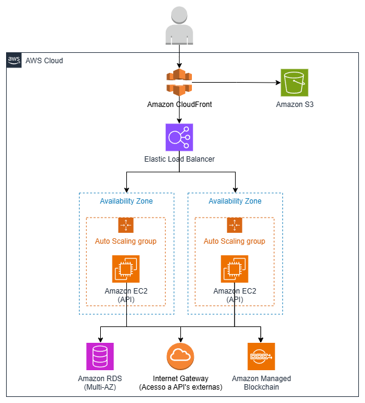

# Visão Física

## Infraestrutura Proposta (AWS)

A arquitetura física do sistema será baseada em serviços gerenciados da AWS, garantindo escalabilidade, segurança e facilidade de manutenção. A seguir, estão os principais componentes:

- **Amazon CloudFront**: Distribui e faz cache do conteúdo do frontend (S3 ou EC2), garantindo baixa latência e melhor experiência para usuários em diferentes regiões.
- **Amazon S3**: Armazena arquivos estáticos do frontend (caso de Single Page Application) e outros artefatos.
- **Amazon EC2**: Hospeda o backend (API) e, opcionalmente, o frontend (caso não utilize serviços serverless).
- **Amazon RDS**: Banco de dados relacional gerenciado para armazenar dados operacionais (usuários, produtos, etc.).
- **Amazon Managed Blockchain**: Serviço gerenciado para integração com a blockchain, facilitando o registro e consulta de eventos.
- **AWS API Gateway**: Gerencia as requisições HTTP para o backend, provendo segurança e escalabilidade.
- **Serviços Externos**: Integração com gateways de pagamento e provedores de autenticação de terceiros.

## Topologia 

Usuários acessam o frontend hospedado no Amazon S3 (ou EC2) por meio do Amazon CloudFront, que distribui e faz cache do conteúdo globalmente. O frontend se comunica com o backend via API Gateway. O backend, hospedado em EC2, interage com o Amazon RDS para persistência de dados e com o Amazon Managed Blockchain para registrar e consultar eventos. Serviços externos, como gateways de pagamento, são acessados conforme necessário.

---

## Diagrama da Infraestrutura AWS

---

## Possibilidades de Evolução
- **Lakehouse**: Futuramente, pode-se integrar uma arquitetura lakehouse utilizando o Amazon S3 como data lake e Amazon Redshift ou Athena para análise de dados, permitindo relatórios avançados e integração com BI.
- **Serverless**: O backend pode ser migrado para AWS Lambda, reduzindo custos e aumentando a escalabilidade.
